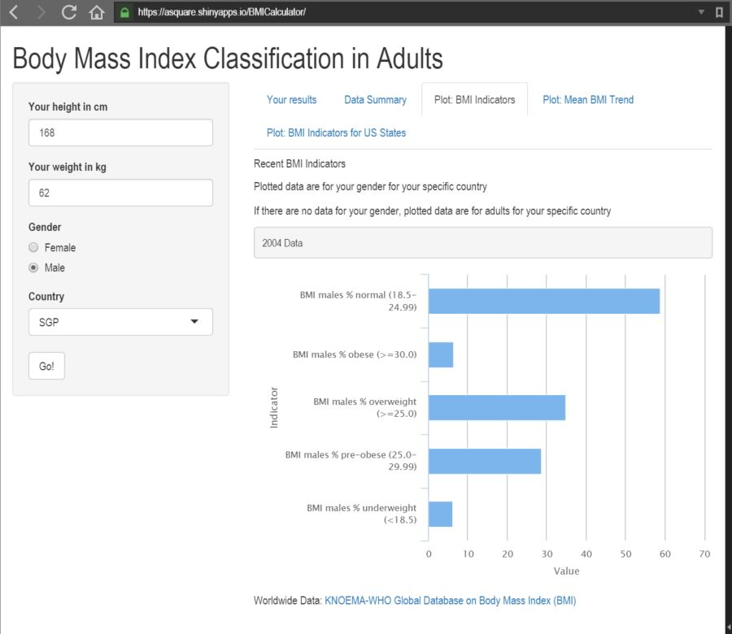

### Intro & Motivation

Body Mass Index (BMI) is a simple index of weight-for-height that is commonly used to classify underweight, overweight and obesity in adults. It is defined as the weight in kilograms divided by the square of the height in metres (kg/m2).  

Key facts:  
* Worldwide obesity has doubled since 1980.  
* In 2008, more than 1.4 billion adults, 20 and older, were overweight. 
* 35% of adults aged 20 and over were overweight in 2008, and 11% were obese.  
* 65% of the world's population live in countries where overweight and obesity kills more people than underweight. 
* Obesity is preventable.

Good Nutrition and regular phisical activity are vital for good health and disease prevention. Overweight and obesity are serious and costly health problem worldwide; it's very important people to be informed and aware of overweight and obesity trends.

--- .class #id 

## Shiny App: BMI Calculator

    

   
[BMI Classification in Adults App Hosted by shinyapps.io](https://asquare.shinyapps.io/BMICalculator/)  

---

## Features

User can enter their weight, height, gender and country to get informed!

*Plot: Mean body mass index(crude estimate) trend by gender in Singapore*   

---

## Features

*Plot: BMI indicators in Georgia, USA*  

